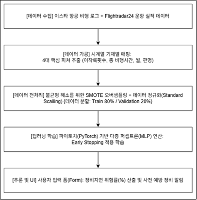
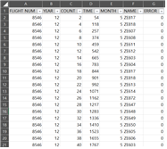
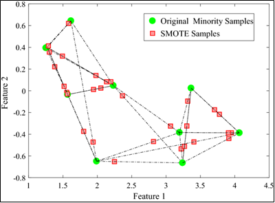
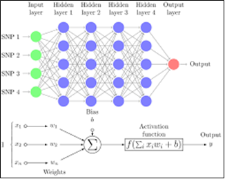
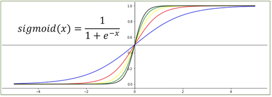

# ✈️ 항공기 운항 시스템 기반 정시성 개선 및 운항 지연 요인 분석 연구
> **2026 고용노동부 미래내일 일경험 프로젝트형 (이스타항공 주식회사 참여)**
> 본 프로젝트는 항공정보포털의 실제 운항 로그와 Flightradar24의 글로벌 항공기 추적 데이터를 연계하여, LCC 운영의 아킬레스건인 '정비지연'을 선제적으로 예방하는 **PyTorch 기반 예지 정비(Predictive Maintenance) 및 정시성 최적화 시스템**입니다.

---

## 📅 Project Timeline
- **전체 수행 기간**: 2026년 4월 ~ 2026년 6월 (총 8주간 진행)

---

## 👥 Team Members & Roles
| 이름 | 소속 | 역할 | 담당 업무 |
| :---: | :---: | :---: | :--- |
| **황정현** | 인하대학교 | **팀장** | 프로젝트 총괄, 애자일 일정 관리, 이스타항공 OCC 피드백 수합 및 최종 결과 보고서 검토 |
| **김소희** | 인하대학교 | **팀원 (ML/DL)** | **정비지연 예측 모델 아키텍처 설계, 다층 인공신경망 학습, 불균형 데이터 처리(SMOTE) 및 추론 알고리즘 성능 평가·해석** |
| **김승찬** | 인하대학교 | 팀원 | 도메인 분석(항공 정시성 저하가 비용 및 연쇄 지연에 미치는 영향), 예방 정비 시나리오 기반 실무 개선안 도출 |
| **김승현** | 인하대학교 | 팀원 | 항공정보포털 및 Flightradar24 데이터 클렌징, 이종 데이터 시계열 기재별 매핑 및 학습 데이터셋 가공 |

---


## ⚙️ System Architecture (전체 수행 흐름)

본 시스템은 정제되지 않은 다량의 항공기 로그 데이터를 전처리 파이프라인에 통과시켜 최종 예방 정비 권고 메시지를 도출하기까지 전 과정을 유기적인 아키텍처로 제어합니다.



---

## 📊 Feature Engineering & Dataset Selection

### 1. 데이터 선정 배경 및 정제 목적
초기 구상 단계에서는 전체 지연 사유를 통틀어 지연 규모를 예측하고 운항 스케줄을 임의 조정하려 했으나, 이스타항공 본사 피드백을 통해 운항 스케줄 조정은 공항 슬롯(Slot), 지상 조업, 타 항공사 연계성 등 복합적 외생 변수로 인해 실무 적용이 불가함을 확인했습니다.

이에 따라, 항공사가 주도적으로 통제 및 사전 예방 조치를 취할 수 있는 **'정비지연(Maintenance Delay)'을 핵심 분석 대상**으로 좁혀 데이터셋을 전면 재구성했습니다. 주관적인 직관에 의존하는 기존 관행에서 벗어나, 제공받은 원본 로그 내에서 기재 노후화와 기계적 결함에 통계적으로 유의미한 영향력을 가지는 변수만 엄격히 선별했습니다.

### 2. 가공 데이터셋 구성 (샘플 이미지)


### 3. 주요 도메인 입력 변수 (4대 인자)
- **이착륙 횟수 (COUNT)**: 항공기 동체, 랜딩 기어, 제동 장치 등에 반복적으로 가해지는 물리적 충격과 역학적 피로도를 대변하는 핵심 지표입니다.
- **총 비행시간 (TIME)**: 항공기 엔진 및 주요 구동 부품의 누적 마마도와 노후화 수준을 정량적으로 나타내는 변수입니다.
- **운항 월 (MONTH)**: 동절기 결빙(De-icing 필요성), 하절기 혹서 등 계절적 환경 및 혹독한 기후 변화가 정비 기재에 미치는 부하를 추적합니다.
- **편명 (FLIGHT NUM)**: 고유 노선의 특성, 운항 패턴, 특정 공항 허브의 인프라적 제약 사항에 따른 지연 규칙성을 파악하기 위해 라벨 인코딩 후 투입했습니다.

---

## 🚀 Deep Learning Mechanics & Mathematical Concepts

### 1. SMOTE를 활용한 극단적 클래스 불균형 (Class Imbalance) 극복
- **문제 정의**: 실제 현장 데이터의 정밀 분석 결과, 약 5,500건의 비행 로그 중 정비지연(1) 사건은 단 40여 건(1% 미만)인 극단적 데이터 비대칭성을 띠고 있었습니다. 이 상태로 학습을 진행하면 모델이 손실 함수를 낮추기 위해 모든 출력을 정상(0)으로 뱉어버리는 다수 클래스 편향(Bias) 오류가 발생합니다.



- **수학적 데이터 합성 기법**: 다수 클래스 데이터를 기계적으로 복제하여 오버핏을 유발하는 무작위 샘플링을 지양하고, 특성 공간 내에서 실제 정비지연 샘플을 기준으로 K-최근접 이웃(K-NN)을 탐색합니다. 기준 샘플과 선택된 이웃 사이의 직선 세그먼트상에 새로운 가상의 합성 정비지연 데이터를 생성하여 채워 넣음으로써 훈련 데이터셋(Train Set) 내 클래스 비율을 1:1로 최적화했습니다.

### 2. 다층 퍼셉트론(MLP) 인공신경망 아키텍처
정형 데이터 분류 및 행렬 연산의 병렬 최적화를 위해 PyTorch 기반의 심층 신경망을 설계했습니다.



- **입력층 & 은닉층 특성 사상 (Feature Space Mapping)**: 4대 인자로 구성된 4차원 입력 벡터($x \in \mathbb{R}^4$)를 수용합니다. 첫 번째 은닉층(Linear Layer)을 통해 4차원 데이터의 선형 결합($W_1x + b_1$)을 수행하여 32차원의 고차원 특징 공간으로 매핑하며, 비선형 활성화 함수인 **ReLU**를 거쳐 복잡한 비선형 패턴에 대한 표현력을 확보합니다. 이후 중간 연산 병목 제어 및 점진적인 특징 압축을 유도하기 위해 두 번째 은닉층은 16차원으로 다운샘플링을 거칩니다.
- **출력층 & Sigmoid Squashing**: 은닉층 연산을 통과한 연속형 수치들을 수리적으로 명확히 해석 가능한 '0.0 ~ 1.0 사이의 정량적 정비지연 발생 확률(%)' 형태로 매핑하기 위해 최종 단에 1차원 선형 레이어와 시그모이드 활성화 함수를 결합했습니다.

$$sigmoid(x) = \frac{1}{1 + e^{-x}}$$



- **안전 마진 확보를 위한 임계치(Threshold) 필터링**: 이진 분류 판단 기준에 보수적인 안전 마진을 적용하기 위해 임계치를 **0.5 (50%)**로 설정했습니다. 극단적 데이터 환경에서 소수의 결함 징후를 놓치지 않기 위해, 미세한 위험 패턴이라도 포착되어 모델의 연산 확률이 50%를 초과하는 즉시 경고 플래그와 함께 예방 정비 권고 알림을 출력하도록 로직을 설계했습니다.

### 3. 인공신경망 규제화 및 동적 조기 종료(Early Stopping) 제어
- **과적합 제어**: 테이블형 데이터가 깊은 신경망을 통과할 때 발생하는 가중치 암기 현상(Overfitting)을 차단하고자, 첫 번째 은닉층 뒤에는 50%, 두 번째 은닉층 뒤에는 30%의 **드롭아웃(Dropout)** 레이어를 배치하여 뉴런 간의 상호 의존성을 파괴했습니다. 또한 **Adam Optimizer** 선언 시 가중치 감쇄(Weight Decay = $1\times10^{-4}$) 파라미터를 인수로 주입하여 L2 Norm 크기를 제한, 검증 손실(Validation Loss) 곡선의 진동 폭을 하향 안정화했습니다.
- **검증 손실 추적 제어 루프**: 매 에폭 학습 종료 시점마다 검증 데이터셋을 통과시켜 `BCELoss`의 추이를 모니터링합니다. 검증 손실이 기존 최저점보다 낮아지면 최적의 가중치 텐서를 `best_model.pth`로 로컬 디스크에 갱신 및 보존하고, 만약 손실이 정체되거나 개악되는 현상이 20회(`Patience=20`) 동안 지속되면 연산을 강제 중단하는 조기 종료 알고리즘을 구현했습니다. (실제 실험 구동 시 **81 에폭** 시점에 완벽 수렴하여 시스템이 스스로 안전하게 중단을 달성했습니다).

---

## ⚙️ Runtime Inference Logic & User Interface

현장 정비 도메인 관리자가 유연하게 가상 운항 시나리오를 주입하고 객체 지향 추론을 돌릴 수 있도록 설계된 내부 조건부 판단 제어 구조입니다.

```text
[현장 관리자의 운항 스케줄 데이터 주입] 
- 이착륙 횟수, 총 비행시간, 운항 예정 월, 편명 직접 입력
- "1565시간 26분", "December" 등 한글/영문 결합 형태 데이터 주입 가능
       │
       ▼
[문자열 자동 정규식 파싱 및 매핑 처리]
- 내부 정규식 연산과 딕셔너리를 거쳐 분(Minute) 단위 및 표준 정수형으로 자동 변환
       │
       ▼
[StandardScaler 스케일러 실시간 연동]
- 학습 단계의 가중치 분포를 유지하기 위해 원본 데이터를 실시간으로 정규화 변환(Transform)
       │
       ▼
[PyTorch FloatTensor 변환 및 순방향 연산]
- 텐서 데이터로 변환 후 현재 연산 장치(CPU/GPU)로 전송하여 시그모이드 최종 레이어 통과
       │
       ▼
[안전 마진 필터링 및 조건부 탐지 판정 (임계치 50%)]
       │
 ┌─────┴─────────────────────────────────────┐
 ▼ (연산 확률 50% 미만)                         ▼ (연산 확률 50% 이상)
[정상 비행 가능 판정]                        [정비지연 위험 수치 발생 알림]
- "특이 징후가 발견되지 않았습니다."           - "사전 예방 정비를 강력히 권고합니다."
- 과잉 정비 비용 절감 가이드라인 제공   - 결항 및 후속 도미노 연쇄 지연 원천 차단
